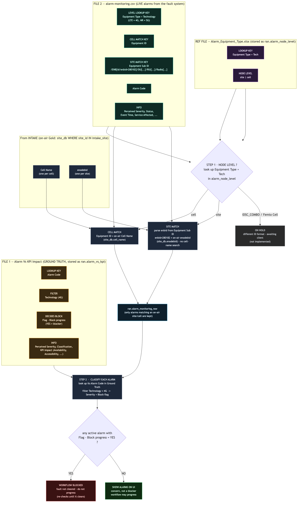

# Fault Agent — 4G · data model & flow (real client data)

> **Status:** design / reference only. Documents the **data model** and **logical flow** for the 4G fault
> check, from the real client files. The files are the **schema reference** — no ingestion/insert here.
>
> **Scope:** 4G only. **Depends on Intake** (uses the on-air site's cells / `Cell Name` from the ECGI file).

---

## 1. The idea

The fault agent asks, for each new on-air 4G site: **are there active alarms, and is any of them a blocker?**
It needs two inputs plus the site's cells from intake:

| Reference file | Role |
|---|---|
| **F1 · Alarm Vs KPI Impact** (`Alarm Vs KPI Impact_9-Apr-26.xlsx`, sheet `Data`) | **Ground truth** — the catalogue of alarms: code, technology, severity, KPI impact, and **whether the alarm blocks progress** → `ran.alarm_vs_kpi` |
| **F2 · alarm-monitoring.csv** (`01.alarm-monitoring.csv`) | **Live feed** — the actual alarms firing right now, from the fault monitoring system → `ran.alarm_monitoring_raw` |
| **F3 · Alarm_Equipment_Type.xlsx** (`Equipment Type` · `Tech` · `Node Level`) | **Node-level reference** — maps each **Equipment Type + Tech → `site` \| `cell`**, i.e. decides *how* an alarm is matched → `ran.alarm_node_level` |

The site's **cells (`Cell Name`) and eNB IDs (`enodebid`)** come from the **Intake on-air Gold set**
(`ran.site_db` rows whose `site_id` is in `ran.intake_site`) — that's how a live alarm is tied to a site.

> There is also a third file, **`alarm-library-flagged progress blocked.xlsx`** — a broader alarm catalogue
> (33 cols) that *also* carries a `Flag - Block progress` column. Not part of your two-file description; see
> open questions (is it the authoritative library, or does F1 win?).

---

## 2. The flow



> Diagram source: `fault_4g_flow.mmd` — re-render with
> `mmdc -i fault_4g_flow.mmd -o fault_4g_flow.png -b white -s 2`

**In words:** for each live alarm, read its **Equipment Type + Technology** and look up the **node level**
(`site` | `cell`) in **F3 (`alarm_node_level`)** → match at that level against the **on-air Gold set**:
`cell` ⇒ `Equipment ID` = `site_db.cell_name`; `site` ⇒ parse `enbid` from `Equipment Sub ID` =
`site_db.enodebid` → only alarms hitting an on-air site/cell land in `ran.alarm_monitoring_raw` → for each,
look up its `Alarm Code` in the **ground truth** (F1, `Technology = 4G`) to get its **severity** and
**block flag** → if **any** active alarm is `Flag - Block progress = YES`, the **workflow is blocked**
(fault not cleared); the rest are shown on the UI as concerns but don't block.

**Which columns do the work:**

| Role | F1 · Alarm Vs KPI Impact (ground truth) | F2 · alarm-monitoring.csv (live) | F3 · alarm_node_level | Intake (on-air Gold) |
|---|---|---|---|---|
| **Level decide** | — | `Equipment Type` + `Technology` | `Equipment Type`+`Tech` → `Node Level` | — |
| **Cell match** | — | `Equipment ID` | — | `site_db.cell_name` |
| **Site match** | — | `enbid` (parsed from `Equipment Sub ID`) | — | `site_db.enodebid` |
| **Alarm join** | `Alarm Code` | `Alarm Code` | — | — |
| **Tech filter** | `Technology` = `4G` | `Technology` = `LTE` *(= 4G)* | `Tech` = `4G` | — |
| **Blocks?** | `Flag - Block progress` (`YES`) | — | — | — |
| **Severity / display** | `Perceived Severity`, `Classification`, KPI-impact cols | `Perceived Severity`, `Status`, `Event Time`, `Service Affected` | — | — |

---

## 3. Matching & decision rules (grounded in the data)

### 3.1 Tie a live alarm — level-driven (site **or** cell)

An alarm is matched at one of **two levels**, and the level is **read from the F3 reference table
`ran.alarm_node_level`, keyed by `Equipment Type` + `Tech`** — not from F1, and not guessed in code:

1. **Node level comes from F3 (`alarm_node_level`).** For each live alarm, look up its
   **`Equipment Type` + `Technology`** in `ran.alarm_node_level` → get **`Node Level` (`site` | `cell`)**.
   The reference is data-owned (one row per equipment type per tech), so adding/retyping equipment never
   touches code. Technology is reconciled in the join: **`LTE ≡ 4G`, `NR ≡ 5G`**.
2. **Branch on the level:**
   - **`cell`** → match `Equipment ID` against the on-air **`site_db.cell_name`**
     (site_db rows whose `site_id ∈ intake_site`).
   - **`site`** → **skip the cell match**. Parse the **`Equipment Sub ID`** MO-path string
     (**not plain text**):
     ```
     /ENB[id/enbid=280182]/DU[id/du-id=2]/RIU[id/riu-id=4]/Radio[id/radio-id=10]
     ```
     → extract **`enbid=280182`** → match it against the on-air **`site_db.enodebid`**. No cell.
3. **Landing:** only alarms that hit an on-air site/cell (either branch) are kept — they land in
   **`ran.alarm_monitoring_raw`**. Alarms whose `Equipment Type`+`Tech` is absent from `alarm_node_level`,
   or whose ID hits no on-air site, are dropped.

This recovers the **site-level equipment** (`Macro ENV` / `MACRO_ENB` = eNodeB, `Macro VDU` = virtual DU)
that a cell-only match would drop.

> **Implementation:** this lives in **`brain/ingestion/plugins/ingestion/transforms/alarm_gold.py`**
> (`populate_alarm_monitoring`), not in a DAG. The on-air match runs at the **raw → gold** step, so
> `ran.alarm_monitoring_raw` keeps the full feed and `ran.alarm_monitoring` keeps only the matched
> rows. The SQL `JOIN`s `ran.alarm_node_level` (`nl.equipment_type = r.equipment_type` AND
> tech-reconciled LTE→4G / NR→5G), then a `JOIN LATERAL` whose branch (`cell`/`site`) picks the
> `site_db` column to match. On-air scoping is the clause
> **`AND s.site_id IN (SELECT site_id FROM ran.intake_site)`**, which appears once per branch —
> `alarm_gold.py:46` (cell) and `alarm_gold.py:53` (site). Raw alarm rows are aliased `r`.
>
> *Corrected 2026-08-12 (Phase 12a plan 06).* This paragraph formerly cited a constant named
> `ALARM_LOAD_FILTER_SQL`, which **no longer exists** anywhere under `brain/` — it was removed
> from the since-deleted `ingest_site_pipeline.py` when the filter moved into the `alarm_gold`
> transform as part of the raw/gold split, and the reference was already stale before Phase 12a.
> The transform now has exactly one caller, `ingest_fault_alarm_monitoring`, which does not hold
> the SQL either — it lives in the transform.

**Why the old (cell-only) match was partial** — evidence on the 439 4G rows:

| Method | Coverage | Equipment types |
|---|---|---|
| exact `Cell Name` = `Equipment ID` | **66%** | cell-level: `MACRO_CELL`, `RIUD_RRH`, `DAS_RRH` |
| + Site-ID prefix (token before first `_`) = ECGI `Site ID` | **76%** | node-level: `Macro`, `RIUD_DU`, `DAS_RIU` |
| neither | **24%** | site/node-level — now handled by the `site` path (parse `Equipment Sub ID`) |

| Equipment Type | Rows | Handling under the level-driven flow |
|---|---|---|
| `MACRO_ENB` (`Macro ENV`) | 81 | **site-level** — parse `enbid` from `Equipment Sub ID` → match `ns_site.enb_id`. No cell search. |
| `MACRO_VDU` (`Macro VDU`) | 6 | **site-level** — same. |
| `IDSC_COMBO_CELL` | 17 | **ON HOLD — do not touch.** Different ID format (`RQA13D1010474_F11_CS01_12`); awaiting customer clarity (see §7). |

**Net flow (top of the fault matching):**
```
tech  = normalise(alarm.Technology)                      # LTE→4G, NR→5G
level = alarm_node_level[alarm.Equipment_Type, tech]     # site | cell   (F3 reference)
if level == "cell":
    keep if alarm.Equipment_ID ∈ on-air site_db.cell_name
elif level == "site":
    enbid = parse_enbid(alarm.Equipment_Sub_ID)          # /ENB[id/enbid=280182]/… → 280182
    keep if enbid ∈ on-air site_db.enodebid
# Equipment Type not in alarm_node_level → dropped
# IDSC_COMBO_CELL / Femto Cell → hold (awaiting client)
# on-air scope: site_db WHERE site_id ∈ intake_site
```

> **Open dependencies:** (a) `Node Level` values in `alarm_node_level` are stored capitalised
> (`Cell` / `Site` / `Femto Cell`) and matched case-insensitively; (b) `IDSC_COMBO_CELL` (`Femto Cell`)
> is deliberately out of scope until the client clarifies — see §7.

### 3.2 Normalise Technology
F2 labels 4G as **`LTE`**; F1 uses **`4G`**. Normalise (`LTE ≡ 4G`) before filtering/joining.

### 3.3 Classify each active alarm
Join the live alarm's `Alarm Code` → F1 ground truth (Technology = 4G) → read `Perceived Severity` +
`Flag - Block progress`. (Only alarms whose `Status` is open/active count.)

### 3.4 The gate
- **any** active alarm with `Flag - Block progress = YES` → **BLOCKED** — the workflow does not progress
  (re-checked until the alarm clears — the park-and-re-trigger dependency).
- otherwise → alarms are **shown on the UI** as concerns; the workflow may progress.

---

## 4. Data model — Ground truth (from F1 `Alarm Vs KPI Impact`)

`ran.alarm_vs_kpi` — one row per alarm code. **All 20 columns** of the `Data` sheet (stored, with data);
the table also has an `impact` column that the 9-Apr-26 issue of the workbook does not carry.
The match **level is no longer a column here** — it lives in the separate F3 reference `ran.alarm_node_level`
(see §4.1), keyed by equipment type rather than alarm code.

Loaded by `ingest_fault_alarm_library` (upsert on `alarm_code`), which carries
`Alarm Vs KPI Impact_*.xlsx` end to end. It used to be loaded by a separate
`ingest_fault_alarm_vs_kpi` DAG over the same workbook; that source is retired and the
mapping now rides on `fault_alarm_library`, the file's only registration.

| Column | Source | Type | Notes |
|---|---|---|---|
| `org_id`, `workspace_id` | — | text | tenant scope |
| `alarm_code` | `Alarm Code` | text | **PK / join key** to live alarms |
| `technology` | `Technology` | text | **filter** (`4G`) |
| `flag_block_progress` | `Flag - Block progress` | bool | `YES` ⇒ blocker |
| `perceived_severity` | ` Perceived Severity` | text | CRITICAL / … |
| `classification` | ` Classification` | text | OUTAGE / … |
| `alarm_name` | `Alarm Name` | text | |
| `impact` | `Impact` | text | **not present in the 9-Apr-26 issue** — mapped anyway, so a reissue carrying it lands; loads null until then |
| `count` | `# Count` | text | stored as text, like every other non-flag column |
| `vendor` | ` Vendor` | text | e.g. `All 4G` |
| `alarm_description` | ` Alarm Description` | text | |
| `probable_cause` | ` Probable Cause` | text | |
| `availability` | `Availability` | text | KPI impact (Source/Neighbor) |
| `accessibility` | `Accessibility` | text | KPI impact |
| `retainability` | `Retainability` | text | KPI impact |
| `intra_hosr` | `Intra HOSR` | text | KPI impact |
| `inter_hosr` | `Inter HOSR` | text | KPI impact |
| `rlf` | `RLF` | text | KPI impact |
| `user_thpt` | `User THPT` | text | KPI impact |
| `x2_rate` | `X2 Rate` | text | KPI impact |
| `ho_attempt_towards_kddi` | `HO Attempt towards KDDI` | text | KPI impact |
| `remarks` | `Remarks` | text | |

PK: `(alarm_code)` — what `09_ns_qaw.sql` actually declares, and what the loader's
`ON CONFLICT` upsert targets. *(This section previously read `(org_id, workspace_id,
alarm_code)`; the table has never been keyed that way.)*

### 4.1 Data model — Node-level reference (from F3 `Alarm_Equipment_Type.xlsx`)

`ran.alarm_node_level` — equipment-type reference, maps equipment type → match level.
Drives the §3.1 branch. Loaded by the standalone `ingest_fault_alarm_equipment_type` DAG
(renamed from `ingest_fault_alarm_node_level`; the table and `source_id` keep their names).

| Column | Source | Type | Notes |
|---|---|---|---|
| `org_id`, `workspace_id` | — | text | tenant scope |
| `equipment_type` | `Equipment Type` | text | **PK** — joins to F2 `Equipment Type` |
| `tech` | `Tech` | text | **PK** — `4G` / `5G` (F2 `Technology` reconciled: `LTE`→`4G`, `NR`→`5G`) |
| `node_level` | `Node Level` | text | **`Cell` \| `Site`** (\| `Femto Cell` = on-hold) — drives §3.1; matched case-insensitively |

PK: `(equipment_type, tech)`.

## 5. Data model — Live alarms (from F2 `alarm-monitoring.csv`)

`ran.ns_alarm_event` — one row per alarm event from the fault system. **All 34 columns** of the CSV, plus
the resolved site/cell link. Roles marked: **[MATCH]** ties it to a site, **[JOIN]** looks it up in the
ground truth, **[GATE]** drives the block decision.

| Column | Source | Type | Notes |
|---|---|---|---|
| `org_id`, `workspace_id` | — | text | tenant scope |
| `site_id` | *resolved* | text | **[MATCH result]** from `Equipment ID` → ECGI (cell or Site-ID prefix) |
| `cell_id` | *resolved* | text | `Sec…` when the match is cell-level; null for node-level |
| `equipment_id` | `Equipment ID` | text | **[MATCH]** key to the site's cells |
| `alarm_code` | `Alarm Code` | text | **[JOIN]** → `ns_alarm_ref.alarm_code` |
| `technology` | `Technology` | text | **[GATE]** `LTE` ⇒ normalise to `4G` |
| `perceived_severity` | `Perceived Severity` | text | Major / … |
| `classification` | `Classification` | text | Outage / … |
| `status` | `Status` | text | Open / … (active vs cleared) |
| `event_time` | `Event Time` | timestamptz | JST |
| `close_time` | `Close Time` | timestamptz | `-` when open |
| `last_occurrence_time` | `Last Occurrence Time` | timestamptz | |
| `occurrence_count` | `Occurrence Count` | int | |
| `ageing` | `Ageing` | text | e.g. `6 Minute(s) 54 Second(s)` |
| `service_affected` | `Service Affected` | text | Yes/No |
| `domain` | `Domain` | text | RAN |
| `vendor` | `Vendor` | text | ALTIOSTAR / … |
| `region_product` | `Region/Product` | text | |
| `prefecture_cluster` | `Prefecture/Cluster` | text | |
| `city_namespace` | `City/Namespace` | text | |
| `rf_cluster_node` | `RF Cluster/Node` | text | |
| `gc_cdc_name` | `GC/CDC Name` | text | |
| `equipment_type` | `Equipment Type` | text | MACRO_CELL / MACRO_ENB / RIUD_RRH / … |
| `equipment_sub_id` | `Equipment Sub ID` | text | |
| `equipment_id_status` | `Equipment ID Status` | text | In-Service / … |
| `alarm_type` | `Alarm Type` | text | |
| `alarm_name` | `Alarm Name` | text | |
| `alarm_description` | `Alarm Description` | text | JSON-ish |
| `probable_cause` | `Probable Cause` | text | |
| `ems` | `EMS` | text | OBF / … |
| `correlation_type` | `Correlation Type` | text | |
| `incident_id` | `Incident ID` | text | |
| `entity_family` | `Entity Family` | text | |
| `reported_severity` | `Reported Severity` | text | |
| `alarm_hierarchy` | `Alarm Hierarchy` | text | |
| `ticket_id` | ` Ticket ID` | text | leading space in header |
| `planned_event_name` | `Planned Event Name` | text | |

PK: a surrogate (e.g. `event_id`) or `(equipment_id, alarm_code, event_time)`; index on
`(org_id, workspace_id, site_id)`. The **fault verdict per site** is derived: does any active
(`status` open) row join to a ground-truth alarm with `flag_block_progress = YES`?

---

## 6. Where this fits — `workflow_id` & Airflow

Fault runs **inside an existing workflow** — Intake already opened it (full picture:
`docs/DATA_MODEL/AGENT_DATA_RELATIONSHIPS.md`):

- It **picks up sites at `intake · passed`** (keyed by `site_id`), writes its `ns_alarm_event` rows keyed by
  `workflow_id` + `site_id` (+ `cell_id` for cell-level matches), classifies them via `ns_alarm_ref`
  (`alarm_code`), and **advances `ns_workflow`** to `fault · passed` or `fault · blocked`.
- `ns_alarm_ref` (the F1 ground truth) is a **shared reference** loaded once for the tenant — not per-site.

**Under Airflow:** `fault_check` is the **second task** of the per-site DAG run. On `blocked`, the run
**parks on a deferrable sensor**; when a later `alarm-monitoring` file clears the blocking alarm, the sensor
fires and the DAG **progresses to Config** — the park-and-re-trigger, keyed by the same `workflow_id`. The
block decision (`Flag - Block progress = YES`) is exactly the gate that decides whether the DAG advances.

## 7. Data-quality flags & open questions

1. **Cell-to-alarm match — now level-driven via F3 (see §3.1).** The level comes from
   **`ran.alarm_node_level`** keyed by **`Equipment Type` + `Tech`**: `site` alarms → parse **`enbid`** from
   the `Equipment Sub ID` MO-path (`/ENB[id/enbid=280182]/…` → `280182` = `site_db.enodebid`); `cell` alarms
   → `Equipment ID` = `site_db.cell_name`. Both scoped to the on-air Gold set (`site_id ∈ intake_site`).
   **`IDSC_COMBO_CELL` (`Femto Cell`) is ON HOLD** — different ID format (`RQA13D…`), awaiting client
   clarity; **do not implement it yet**.
2. **Technology label** — `LTE` (F2) vs `4G` (F1); normalise.
3. **Third file** — is `alarm-library-flagged progress blocked.xlsx` the authoritative library, or does F1
   `Alarm Vs KPI Impact` win for the block flag? (Their `Alarm Code` formats differ: `1246` vs `WT-49181863`.)
4. **Active vs cleared** — which `Status` values count as "active" (`Open` / not `Close Time`)?
5. **Alarm code uniqueness** — unique per technology, or can the same code mean different things across 4G/5G?
6. **`Flag - Block progress`** — values seen as `YES`/blank; confirm blank = not a blocker.
